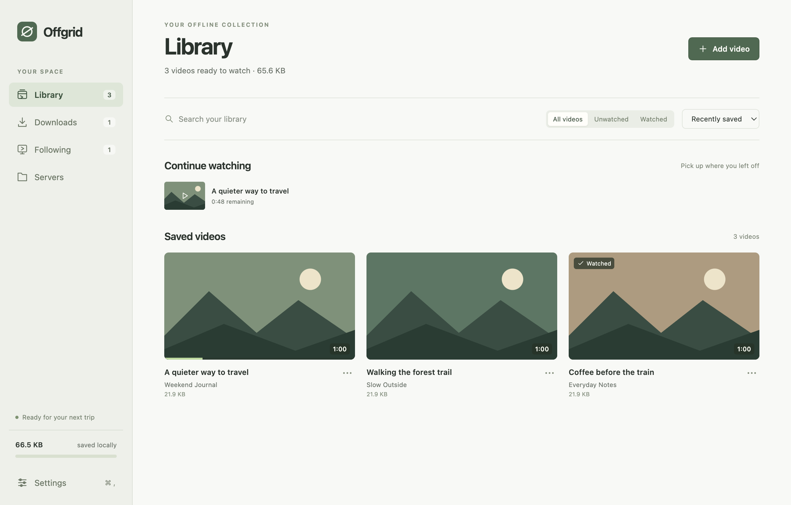

# Offgrid

**Save before you leave. Watch when you get there.**

Offgrid is a desktop video library for flights, train rides, weekends away, and unreliable Wi-Fi. Download videos from YouTube or your local Plex and Jellyfin servers, keep them in one place, and pick up where you left off without an internet connection.

[Download the latest Mac release](https://github.com/Matt-Mc/OffGrid/releases/latest) · [Build status](https://github.com/Matt-Mc/OffGrid/actions/workflows/release.yml)

Built with Electron and React. Early-stage, personal software: feedback and small contributions are welcome.



*The app running with sample videos and generated thumbnails. No personal library data is shown.*

[Platform support](#platform-support) · [Getting started](#getting-started) · [Plex and Jellyfin](#plex-and-jellyfin) · [Troubleshooting](#troubleshooting) · [Development](docs/development.md)

## What you can do

- **Save YouTube videos.** Preview a link, choose a quality from 480p to Best available, and optionally keep comments.
- **Bring your home library.** Browse and search Plex or Jellyfin movies, seasons, and episodes. Download individual titles as original files.
- **Prepare a download queue.** See progress, cancel or retry jobs, and stop the queue after the current download. Queue state survives restarts.
- **Follow YouTube channels.** Check for new videos and opt into automatic downloads while Offgrid is open and online.
- **Watch and resume.** Search your saved library, filter watched videos, and continue from your last position. Compatible YouTube downloads have a built-in player; mpv handles broader format support.
- **Keep storage predictable.** Set a library limit and manage saved videos. Offgrid holds new work when space runs out instead of automatically deleting your collection.

## Platform support

**The published Mac release targets Apple Silicon.** Windows x64 support includes an installer, managed player setup, native playback, and verified installer updates. Windows checks cover generated offline media and local server fixtures; broader real-machine testing remains useful.

| Platform | Current status |
| --- | --- |
| **macOS — Apple Silicon (M-series)** | Tested app and ARM64 DMG. Library, queue, playback, and Plex/Jellyfin fixture flows verified. |
| **macOS — Intel** | Download-tool architecture support exists; no Intel package or runtime validation yet. |
| **Linux — x64 / ARM64** | Experimental. Download-tool selection and mpv integration exist; installers, desktop integration, and real-machine behavior remain unverified. Server sign-in requires a working desktop secret store. |
| **Windows — x64** | NSIS installer, managed mpv setup, playback/resume, and process-tree cancellation. First-time player and download-tool setup requires internet. Targets Windows 10/11 x64; local verification uses Windows 11. |

Other architectures are not currently supported. No minimum OS version has been validated for Offgrid itself.

See the [platform roadmap](#platform-roadmap) for the remaining work. Linux source builds remain experimental; native Windows ARM64 and 32-bit packages are not provided.

## Getting started

### macOS app

1. Obtain the ARM64 `.dmg` from the project's maintainer or from the repository's [Releases page](https://github.com/Matt-Mc/OffGrid/releases) if a release has been published. Installers are not stored in the source tree.
2. Open it, drag **Offgrid** into **Applications**, then launch that copy. Quit older copies running directly from a mounted disk image.
3. mpv is included in installers built from version 0.3.0 onward; no Homebrew or separate player installation is needed. Check the release notes for the required macOS version.
4. Open **Settings** to check the bundled player status. Add a YouTube link in **Downloads**, or connect a home server in **Servers**.

Current personal builds are signed ad hoc and are **not notarized**. macOS may display a security warning, and updates may prompt for permissions again. A polished signed release for wider distribution is still planned.

You do not need Node.js to run a packaged app. The installer includes its own mpv runtime and supporting playback libraries. Offgrid attempts to download and verify its managed copies of **yt-dlp** and **FFmpeg** when online; YouTube downloads may need that first-time setup to finish.

### Windows app

Run `Offgrid-<version>-win-x64.exe` from a release that includes Windows assets and follow the setup prompts. The installer preserves your separate library data when updating or uninstalling. Current Windows builds are unsigned.

On first launch, stay online while Offgrid downloads and verifies mpv, yt-dlp, and FFmpeg. Check **Settings** for player and download-component readiness before going offline. Player setup also downloads and verifies the official 7-Zip standalone extractor; if setup fails, reconnect and use **Refresh player** in Settings. Once setup finishes, Plex/Jellyfin originals play in a separate mpv window with saved viewing progress, including offline.

### App updates

Installed builds check GitHub for a newer compatible release shortly after opening. Offline or failed checks stay quiet, and Offgrid checks again when your connection returns. You can also use **Settings → About & diagnostics → Check for updates**.

When a release is available, a dismissible banner offers **Update to [version]**. One click downloads and verifies the matching installer, then opens it. On Mac, quit Offgrid and drag the new copy into **Applications**. On Windows, follow the installer prompts. Your saved library stays in its separate data folder. Updates currently use this installer flow rather than automatic installation.

### Run from source

Install **Node.js 22 or newer** and npm, then clone the repository:

```bash
git clone https://github.com/Matt-Mc/OffGrid.git
cd OffGrid
npm ci
npm run dev
```

For a production renderer build:

```bash
npm run build
npm start
```

A desktop session is required. Mac source runs use a system mpv installation: `brew install mpv`. Linux users also need mpv for server media and an unlocked credential store such as GNOME Keyring or KWallet. Windows x64 source runs use the same managed player setup as packaged builds. Build a Windows installer on Windows with `npm run dist:win`.

## Plex and Jellyfin

Both connections use your **local network**. Offgrid supports private LAN and loopback addresses, rejects redirects and public destinations, and does not require internet connectivity to reach a server that is still available on your LAN.

### Plex

Open **Servers → Plex** and enter:

- Your server address, for example `http://192.168.1.20:32400`.
- A token for an account that can access that server. Follow [Plex's token instructions](https://support.plex.tv/articles/204059436-finding-an-authentication-token-x-plex-token/).

Use the server address and port only, without a `/web` path. Tokens can expire; reconnect if authentication stops working.

### Jellyfin

Open **Servers → Jellyfin**, enter your address, for example `http://192.168.1.20:8096`, and sign in with your Jellyfin username and password. Include a base path such as `/jellyfin` if your server uses one.

Your account needs library access and [permission to download](https://jellyfin.org/docs/general/server/users/adding-managing-users/). Offgrid stores the returned access token, **never your Jellyfin password**. Plex and Jellyfin connections are saved independently.

### Local access and playback

Use **Request local access** on macOS, or **Check server connection** elsewhere, to test the entered address before signing in. On macOS this can trigger the first local-network permission prompt. Choose **Allow**. If access was previously denied, use **Open Local Network settings**, enable Offgrid, and check again.

Downloads preserve the original file and embedded audio/subtitle tracks. They play in a separate mpv window; Offgrid provides pause/resume and stop controls and saves playback progress. Use mpv's own controls for audio tracks, subtitles, seeking, and fullscreen.

Disconnecting a server cancels its unfinished downloads and removes its saved credentials. It keeps already-downloaded videos.

## Storage and privacy

Your media, library, download queue, settings, and viewing progress stay on your computer. Use the storage controls in **Settings** to open the app's data folder. That folder contains private library information; do not commit or attach it to an issue.

Server tokens are encrypted through the operating system using Electron's [safeStorage](https://www.electronjs.org/docs/latest/api/safe-storage). Offgrid refuses to save them when usable credential encryption is unavailable, including Linux's `basic_text` fallback. Credentials are not included in media URLs or returned to the UI. HTTP connections are unencrypted on the LAN; HTTPS requires a valid server certificate.

Offgrid contacts the services needed for your requested downloads and channel checks, GitHub for app-release checks and managed tools, and LunarG for the private Windows Vulkan loader. App-release checks send no library information, server credentials, or GitHub token. Installer downloads begin only when you choose to update. New installations keep automatic channel downloads and saved comments off until you enable them. Existing installations retain their prior preferences. There is no Offgrid account or cloud library sync.

The optional **Maximum library size** counts saved media, thumbnails, and temporary download files. Offgrid also preserves a **2 GB free-disk reserve**. Processing can need more space than the final video, so downloads may wait even when the finished file would fit. Lowering the limit never automatically deletes existing videos.

Before a trip, finish downloads and try playback with your network disconnected. A queued or partially downloaded item is not ready for offline viewing.

## Known limitations

- Server downloads are original quality only: no transcoding or full-season batch downloads.
- Plex uses the first media version. Jellyfin requires one unambiguous local original file with a known size. Multipart titles and ambiguous Jellyfin versions are not supported.
- Server artwork and external subtitle files are not downloaded. Embedded tracks stay in the original file.
- Watched status and playback position stay in Offgrid; they do not sync back to Plex or Jellyfin.
- Interrupted downloads restart from the beginning when retried; byte-range resume is not implemented.
- Channel checks run only while the app is open. There is no background service or remote server discovery. App updates open a verified installer; installation is completed manually.
- YouTube availability can change. Private, restricted, or DRM-protected content is not a supported workflow.

## Troubleshooting

| Symptom | What to check |
| --- | --- |
| Server works in a browser but not Offgrid | Confirm the local address and port. On macOS, check **Privacy & Security → Local Network**. Development runs may appear as **Electron**. |
| The local-access check fails | The server may be offline, the address may be wrong, or network access may be blocked. The check reports reachability; it cannot conclusively identify permission denial. |
| Server credentials cannot be saved | Unlock the system keychain/credential store. On Linux, a usable desktop secret store is required; Offgrid does not fall back to plaintext tokens. |
| Plex or Jellyfin will not play | Packaged Mac builds include mpv; reinstall if it is missing or damaged. On Windows, reconnect to the internet and refresh the player in Settings to complete or repair setup. Mac/Linux development runs need system mpv. |
| A download is waiting for storage | Free disk space, remove saved videos, or increase the library limit. For YouTube, retry at a lower quality. Server downloads retain original quality. |
| YouTube downloads fail | Check connectivity and the yt-dlp/FFmpeg status in Settings. Update the managed tools and retry; some content is unsupported. |
| Download stopped when the app closed | Reopen **Downloads** and retry the interrupted item. Partial files are cleaned up; completed files remain available. |

When reporting a bug, include the app version, OS and CPU architecture, provider, reproduction steps, and the error text. Remove tokens, passwords, private server addresses, and personal media details from logs or screenshots.

## Platform roadmap

- **Windows:** broaden hardware/codec and real-server testing, add installer signing, and evaluate native ARM64 support.
- **Linux:** validate mpv, credential storage, downloads, cancellation, and desktop integration on real distributions; choose and test installer formats.
- **macOS Intel:** build and validate x64 packages and native playback.
- **All platforms:** add broader native UI coverage and Linux release packaging, and keep Electron/dependencies current. Add developer signing/notarization where appropriate.

Merging a PR into `main` automatically reserves the next patch version, builds a macOS ARM64 DMG and Windows x64 installer, and publishes both through [GitHub Actions](https://github.com/Matt-Mc/OffGrid/actions/workflows/release.yml). Both platform jobs must pass before publication. Failed runs can be retried with the same version; published releases are never overwritten. Explicit stable tags are also supported. Windows assets use `SHA256SUMS-windows`; Mac assets retain `SHA256SUMS` and their bundled runtime sources. Pull requests run both platform test suites and build a downloadable Windows test installer.

## Contributing

Small fixes, clear bug reports, and help testing Windows/Linux are welcome. Start with the [development guide](docs/development.md) for architecture, test commands, packaging, and release checks. For larger changes, discuss the approach in an [issue](https://github.com/Matt-Mc/OffGrid/issues) first.

Keep the interface quiet, preserve users' saved files, and test cancellation and storage behavior when changing downloads. Use disposable fixtures rather than personal media or credentials in tests.

## License

Offgrid is released under the [MIT License](LICENSE). Dependencies and external tools retain their own licenses. See [bundled runtime notices and corresponding sources](docs/third-party.md); mpv and its dependencies are not covered by Offgrid’s MIT license.

Only download media you own or have permission to save. Offgrid is not affiliated with YouTube, Plex, Jellyfin, or mpv.
